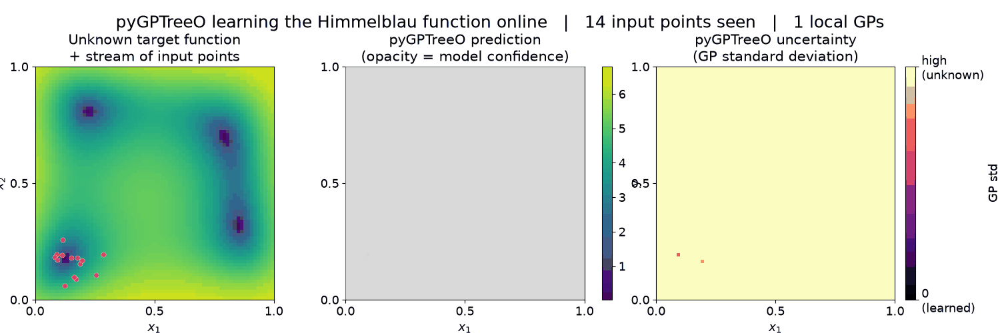

# pyGPTreeO: a Gaussian process tree for online regression

(Work in progress.)



*pyGPTreeO learning a 2D target function (Himmelblau) online, from a stream of input points. The points do not cover the whole input space — they mimic an optimiser/adaptive sampler: a cluster that starts broad and gradually shrinks as its centre sweeps across the domain, finally converging onto a minimum of the target function (the upper-right one) which it then samples in high detail. **Left:** the unknown target function with the incoming data drawn on top (grey = seen earlier, red = just arrived). **Middle:** pyGPTreeO's current prediction, shown only as strongly as the model is confident there (opacity = confidence); the thin white rectangles are the leaves of the GP tree — local GP models that the tree grows where data is dense. **Right of that:** the predictive uncertainty, and **far right:** the absolute prediction error against the true function. The key point: the target is learned — low uncertainty *and* low error — only in the regions where input points have actually been received. The prediction "fills in" where the data goes while regions that are never sampled stay unknown. Generated by [`examples/make_readme_gif.py`](examples/make_readme_gif.py).*

## Introduction
pyGPTreeO is a Python tool designed for online/continual regression tasks. It implements a dynamically growing tree where each leaf node is a local Gaussian Process (GP) regressor. This structure makes it particularly well-suited for learning from data streams where data points arrive sequentially. It builds on the DLGP approach by Lederer et al (https://arxiv.org/abs/2006.09446) and the R package GPTreeO (https://arxiv.org/abs/2410.01024).

## Features
*   **Dynamic tree structure**: The tree adaptively changes its structure based on the incoming data, growing by splitting nodes as more data is observed in specific regions.
*   **Local GP models**: Utilizes Gaussian Process regressors at the leaf nodes to perform regression, capturing local data characteristics.
*   **Continual learning**: Designed to learn from data points one by one, allowing the model to evolve over time.
*   **Online prediction**: Capable of making predictions at any point during the learning process.
*   **Ensemble method**: Includes `GPForest` for running an ensemble of multiple GPTrees, which can improve prediction stability and accuracy.
*   **Customizable GPRs**: Allows users to define and use their own scikit-learn compatible Gaussian Process Regressor models within the tree nodes.
*   **Additive leaf kernels**: `AdditiveMaternKernel` and related kernels can exploit low-order (additive / pairwise) structure in the target, which often needs fewer data points to fit. See [Selecting a leaf kernel](#selecting-a-leaf-kernel).

## How it works (briefly)
GPTreeO builds a binary tree where each node represents a specific region of the input space.
- Leaf nodes contain their own Gaussian Process (GP) model, which is trained on the data points that fall into that node's defined region.
- When a leaf node accumulates a sufficient number of data points (determined by the `Nbar` parameter), it splits into two children. This process creates more specialized models for subregions of the data space.
- Predictions are typically made by the GP model in the leaf node into which a new data point falls. For overlapping regions (due to the `theta` parameter) or when using `GPForest`, predictions can be a weighted average from multiple relevant GPs.

## Installation
Details on installing via pip will be added soon. For now, you can clone the repository and install dependencies:
```bash
git clone https://github.com/your-username/pygptreeo.git # Replace with the actual repository URL
cd pygptreeo
pip install numpy scikit-learn binarytree tqdm joblib
```

## Usage example
Here's a simple example of how to use GPTreeO:

```python
import numpy as np
from pygptreeo import GPTree, Default_GPR

# 1. Initialize GPTree
# You can use the Default_GPR or define your own scikit-learn compatible GPR
# Nbar is the maximum number of points per leaf before it considers splitting.
gpt = GPTree(Nbar=50)

# 2. Prepare some data
# Let's create some 1D data for simplicity
X_train = np.linspace(0, 10, 100).reshape(-1, 1)
y_train = np.sin(X_train).ravel().reshape(-1, 1)

# 3. Feed data points to the tree sequentially
print("Training the GPTree...")
sigma = 1e-3  # observation noise (standard deviation) for each point
for i in range(len(X_train)):
    # GPTree expects 2D input for X and y for a single sample
    x_sample = X_train[i:i+1, :]
    y_sample = y_train[i:i+1, :]
    # update_tree(x, y, sigma): sigma is the observation-noise std for this point
    gpt.update_tree(x_sample, y_sample, sigma)
    if (i + 1) % 20 == 0:
        print(f"Processed {i+1}/{len(X_train)} points.")

# 4. Make predictions
print("\nMaking predictions...")
X_test = np.array([[0.5], [2.5], [5.5], [7.5], [9.5]])
y_pred, y_std = gpt.predict(X_test)

for i in range(len(X_test)):
    print(f"Input: {X_test[i,0]}, Prediction: {y_pred[i,0]:.4f}, StdDev: {y_std[i,0]:.4f}")

# The tree structure can be printed (optional, can be very large for many points)
# print("\nGPTree structure:")
# print(gpt.root)
```

## Selecting a leaf kernel

By default each leaf uses a plain Matérn kernel. For many targets `AdditiveMaternKernel`
is a better choice — it adds a low-order additive component (a sum of main effects and
pairwise interactions) on top of a Matérn catch-all:

```python
from pygptreeo import GPTree, Default_GPR, AdditiveMaternKernel

d = 4  # input dimensionality
kernel = AdditiveMaternKernel(d=d, order=2, nu=1.5)
gpt = GPTree(GPR=Default_GPR(kernel=kernel, alpha=1e-6), Nbar=100)
```

The additive component uses only `d` length scales plus one variance per interaction
order, so it needs fewer data points to fit when the target really does decompose this
way. `order` sets the highest interaction order (1 for main effects only, 2 to add
pairwise terms) and `base` (`"rbf"` or `"matern"`) sets its smoothness. The catch-all
soaks up whatever is left. So even when the target has no additive structure there is 
typically little harm in using `AdditiveMaternKernel`, except for the increased run time 
from fitting more hyperparameters. The hyperparameters are tuned per leaf by 
marginal-likelihood maximisation.

Other options:

* **No additive structure** → a plain anisotropic `Matern(nu=1.5) + RBF`, wrapped in a
  `ConstantKernel`. Simpler and cheaper than the additive kernel.

  ```python
  from sklearn.gaussian_process.kernels import ConstantKernel, Matern, RBF

  kernel = ConstantKernel() * (Matern(nu=1.5, length_scale=[1.0] * d)
                               + RBF(length_scale=[1.0] * d))
  ```

* **Periodic inputs** → `AdditivePeriodicMaternKernel(d)`, which adds a per-dimension
  periodic component. Worth it only when several oscillation cycles fall within a single
  leaf; for low-frequency or coupled periodicity the additive kernel above is usually
  enough. (For `d > 1` the periodic part has to be built per dimension — scikit-learn's
  `ExpSineSquared` is not positive-definite in more than one dimension.)

  ```python
  from pygptreeo import AdditivePeriodicMaternKernel

  kernel = AdditivePeriodicMaternKernel(d=d)
  ```

`AdditiveMaternKernel` returns an ordinary scikit-learn kernel, so you can also assemble
the combination by hand from `NewtonGirardAdditiveKernel` if you want to customise the
pieces.

## Running examples
For more detailed demonstrations, see the example scripts in the `examples/` directory:

*   `examples/example.py`: Shows a basic workflow of training and predicting with `GPTree`.
    ```bash
    python examples/example.py
    ```
*   `examples/performance_test.py`: Demonstrates performance metrics tracking and visualization during online learning.
    ```bash
    OMP_NUM_THREADS=1 python examples/performance_test.py
    ```
*   `examples/test_animated.py`: Provides an animated visualization of the `GPTree` learning process for 2D data.
    It requires command-line arguments:
    ```bash
    python examples/test_animated.py <target_function_name> <n_points> <Nbar> <retrain_step> <update_step> <live_update_bool>
    ```
    For example:
    ```bash
    python examples/test_animated.py eggholder 10000 200 200 10 1
    ```
    (Available target functions: `eggholder`, `himmelblau`, `rosenbrock`, `rastrigin`, `levy`, `custom`)

## Contributing
Contributions are welcome! Please feel free to submit issues or pull requests.

## License
This project is licensed under the terms of the LICENSE file.
