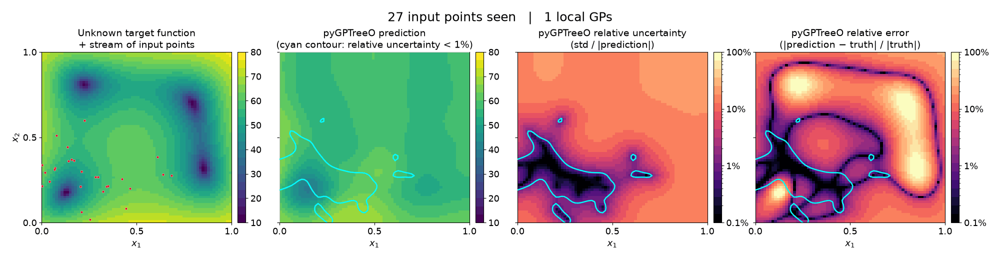

# pyGPTreeO: a Gaussian process tree for online regression



*pyGPTreeO learning a 2D target (Himmelblau) online from a stream of input points that arrive as a moving cluster sweeping across the domain. **Left to right:** the unknown target with the incoming data (white = seen earlier, red = just arrived); pyGPTreeO's prediction, overlaid with the white GP-tree partition and a cyan contour marking where the relative uncertainty falls below 1%; then the relative predictive uncertainty and the relative error (log scale, 0.1%–100%). The target is learned — low uncertainty *and* low error — only where input points have actually been received. Generated by [`examples/make_readme_gif.py`](examples/make_readme_gif.py).*

## Introduction
pyGPTreeO is a Python tool designed for online/continual regression tasks. It implements a dynamically growing tree where each leaf node is a local Gaussian Process (GP) regressor. This structure makes it particularly well-suited for learning from data streams where data points arrive sequentially. It builds on the DLGP approach by Lederer et al (https://arxiv.org/abs/2006.09446) and our R package [GPTreeO](https://cran.r-project.org/web/packages/GPTreeO/index.html) (https://arxiv.org/abs/2410.01024).

## How it works (briefly)
- Using the sequential input stream, GPTreeO dynamically constructs a binary tree where each node represents a specific region of the input space.
- Leaf nodes contain their own Gaussian Process (GP) model, which is trained on the data points that fall into that node's defined region.
- When a leaf node accumulates a sufficient number of data points (determined by the `Nbar` parameter), it splits into two children. This process creates more specialized models for subregions of the data space.
- Predictions are typically made by the GP model in the leaf node into which a new data point falls. For overlapping regions (controlled by the `theta` parameter) or when using `GPForest`, predictions can be an aggregate prediction from multiple relevant GPs.

Interfaces to several established GP packages already exist, and the code can easily be extended with more. 


## Installation
Details on installing via pip will be added soon. For now, you can clone the repository and install dependencies:
```bash
git clone https://github.com/your-username/pygptreeo.git # Replace with the actual repository URL
cd pygptreeo
pip install numpy scikit-learn binarytree tqdm joblib
```

## Usage example
Here's a simple example of how to use GPTreeO:

```python
import numpy as np
from pygptreeo import GPTree, Default_GPR

# 1. Initialize GPTree
# You can use the Default_GPR or define your own scikit-learn compatible GPR
# Nbar is the maximum number of points per leaf before it considers splitting.
gpt = GPTree(Nbar=50)

# 2. Prepare some data
# Let's create some 1D data for simplicity
X_train = np.linspace(0, 10, 100).reshape(-1, 1)
y_train = np.sin(X_train).ravel().reshape(-1, 1)

# 3. Feed data points to the tree sequentially
print("Training the GPTree...")
sigma = 1e-3  # observation noise (standard deviation) for each point
for i in range(len(X_train)):
    # GPTree expects 2D input for X and y for a single sample
    x_sample = X_train[i:i+1, :]
    y_sample = y_train[i:i+1, :]
    # update_tree(x, y, sigma): sigma is the observation-noise std for this point
    gpt.update_tree(x_sample, y_sample, sigma)
    if (i + 1) % 20 == 0:
        print(f"Processed {i+1}/{len(X_train)} points.")

# 4. Make predictions
print("\nMaking predictions...")
X_test = np.array([[0.5], [2.5], [5.5], [7.5], [9.5]])
y_pred, y_std = gpt.predict(X_test)

for i in range(len(X_test)):
    print(f"Input: {X_test[i,0]}, Prediction: {y_pred[i,0]:.4f}, StdDev: {y_std[i,0]:.4f}")

# The tree structure can be printed (optional, can be very large for many points)
# print("\nGPTree structure:")
# print(gpt.root)
```

## Selecting a leaf kernel

By default each leaf uses an anisotropic Matérn kernel (`ConstantKernel() * Matern(nu=1.5)`
with one length scale per input dimension, built once the input dimension is known).
The per-dimension length scales are what the default split criterion
`split_dimension_criteria='min_lengthscale'` uses: a leaf splits along the dimension
in which its GP says the target varies fastest. With a kernel that has no
per-dimension length scales the tree falls back to splitting the widest dimension.

For many targets `AdditiveMaternKernel`
is a better choice — it adds a low-order additive component (a sum of main effects and
pairwise interactions) on top of a Matérn catch-all:

```python
from pygptreeo import GPTree, Default_GPR, AdditiveMaternKernel

d = 4  # input dimensionality
kernel = AdditiveMaternKernel(d=d, order=2, nu=1.5)
gpt = GPTree(GPR=Default_GPR(kernel=kernel, alpha=1e-6), Nbar=100)
```

The additive component uses only `d` length scales plus one variance per interaction
order, so it needs fewer data points to fit when the target really does decompose this
way. `order` sets the highest interaction order (1 for main effects only, 2 to add
pairwise terms) and `base` (`"rbf"` or `"matern"`) sets its smoothness. The catch-all
soaks up whatever is left. So even when the target has no additive structure there is 
typically little harm in using `AdditiveMaternKernel`, except for the increased run time 
from fitting more hyperparameters. The hyperparameters are tuned per leaf by 
marginal-likelihood maximisation.

Other options:

* **No additive structure** → a plain anisotropic `Matern(nu=1.5) + RBF`, wrapped in a
  `ConstantKernel`. Simpler and cheaper than the additive kernel.

  ```python
  from sklearn.gaussian_process.kernels import ConstantKernel, Matern, RBF

  kernel = ConstantKernel() * (Matern(nu=1.5, length_scale=[1.0] * d)
                               + RBF(length_scale=[1.0] * d))
  ```

* **Periodic inputs** → `AdditivePeriodicMaternKernel(d)`, which adds a per-dimension
  periodic component. Worth it only when several oscillation cycles fall within a single
  leaf; for low-frequency or coupled periodicity the additive kernel above is usually
  enough. (For `d > 1` the periodic part has to be built per dimension — scikit-learn's
  `ExpSineSquared` is not positive-definite in more than one dimension.)

  ```python
  from pygptreeo import AdditivePeriodicMaternKernel

  kernel = AdditivePeriodicMaternKernel(d=d)
  ```

`AdditiveMaternKernel` returns an ordinary scikit-learn kernel, so you can also assemble
the combination by hand from `NewtonGirardAdditiveKernel` if you want to customise the
pieces.

## Multi-output targets

Pass `n_outputs=p` and feed `y` (and `sigma`) as arrays with `p` columns. How the
outputs are modelled inside each leaf is set by `output_model`:

* `'independent'` (default): one GP per output, each with its own kernel hyperparameters.
* `'shared'`: one GP with a single shared kernel for all outputs. One Cholesky
  factorisation per leaf instead of `p`, at essentially the same accuracy when the
  outputs have similar length scales. Needs the scikit-learn backend.
* `'pca'`: the tree learns a global linear basis of the output space (PCA on a
  reservoir sample of the stream) and each leaf models only the leading basis scores
  with one GP each; predictions are mapped back to output space together with their
  uncertainties. This is the right choice for strongly correlated outputs, e.g. a
  function `f(t; x)` observed on a `t`-grid, where a handful of components carry all
  the signal. By default the number of components is chosen from the observation
  noise you pass (`sigma`): every component whose variance rises above the noise level
  is kept, so noisy targets get few components and clean targets get more. Use
  `output_basis_components=<int>` or `=<fraction of variance>` to fix it instead.

```python
gpt = GPTree(Nbar=50, n_outputs=100, output_model='pca')
gpt.fit(X_train, Y_train, sigma_train)          # Y_train: (N, 100), e.g. f(t; x) on a t-grid
Y_pred, Y_std = gpt.predict(X_test)             # (n_test, 100) each
```

`examples/multioutput_function_learning_pca.py` compares the three modes on a
function-learning problem, with and without an intermediate B-spline representation.

## Global model + residual tree (opt-in)

By default the leaf GPs model the target directly. With `global_mean='additive_gp'` the tree
also maintains one tree-wide global model, a GP with a low-order additive + Matérn kernel
fitted on a coverage sample of the stream, and the leaf GPs model its *residual*:

```python
gpt = GPTree(Nbar=100, global_mean='additive_gp')
# tune the built-in learner, e.g. a smaller reservoir and a single optimizer restart:
gpt = GPTree(Nbar=100, global_mean='additive_gp',
             global_mean_kwargs=dict(reservoir_size=300, n_restarts_optimizer=1))
```

The global model pools all the data the tree has seen and captures smooth, low-order,
large-scale structure that no single leaf can see from its own points; the leaves capture
the rest and, at their edges, revert to the global model instead of to a leaf constant. It
is refit only when the coverage sample has changed materially, so it freezes itself when
the stream stops exploring (e.g. an optimiser narrowing in) and resumes when the stream
enters new territory. Leaves remember the snapshot they were fitted against and refit on
first use after a newer one exists, so a refit never leaves a stale combination behind.
The predicted sigma of a leaf combines its residual GP's uncertainty with the learner's
running estimate of the global model's own (epistemic) error, so it stays an uncertainty
about the underlying function, as without a global model.

On targets with low-order additive structure the gain is large (orders of magnitude on the
standard N-dimensional benchmarks); on targets without it, expect a 15-50 % lower error at
several times the run time. `examples/BENCHMARK_RESULTS_global_mean_streams.md` has the
measurements under uniform, focusing, sweeping and random-walk input streams. Leave
`global_mean=None` (the default) to run the tree exactly as before.

## Neural-linear leaves (opt-in, needs PyTorch)

For targets of many inputs the leaf GPs run out of points: a hundred-point leaf
cannot fit a function of ten inputs and eleven kernel hyperparameters. The
neural-linear backend shares what is global across the whole tree and keeps what
is local in the leaves: one tree-wide feature network is trained on the stream
(at a fixed cost per refit, refit when the point count has doubled), and every
leaf is a Bayesian linear regression on the network's features of the residual
of the network's own prediction. The leaf fit is a closed form on at most `Nbar`
points, the sigma is the posterior sigma of that regression, and the rest of the
tree (splitting, overlap, per-leaf calibration) is unchanged:

```python
from pygptreeo import GPTree, NeuralLinearGPR, FeatureNetLearner

learner = FeatureNetLearner(steps_per_update=8)       # refits spread over the stream, no latency spikes
gpt = GPTree(GPR=NeuralLinearGPR(learner), Nbar=100)  # per-leaf standard scaling is switched off for it
```

The network is trained by full-batch L-BFGS (300 iterations per refit) on a
5000-point coverage reservoir of the stream, with each point's squared error
weighted by the inverse of its noise variance plus the network's own error
variance; `reservoir_size` sets the sample, `optimizer='adam'` switches to
minibatch Adam (4000 steps, which may then run on every point,
`reservoir_size=None`) and `weight_by_sigma=False` switches the weighting off.
`steps_per_update=None` runs each refit in one go instead. On the 6D stream benchmark it has a quarter to a half of the plain
tree's error. Its sigma is the calibrated posterior sigma of the leaf regression
with a floor: the leaf's local leave-one-out error near its points, rising to the
function's overall scale beyond two nearest-neighbour spacings from them
(`NeuralLinearGPR(distance_floor=...)`). Away from the stream that makes the
sigma conservative rather than overconfident, at the price of over-covering a
wandering stream's own next points; `examples/BENCHMARK_RESULTS_neural_linear.md`
has the coverage numbers per stream. `docs/neural_gptree_ideas.md` has the
design and the alternatives considered.

The same network can instead serve as the tree's global model, with the leaf GPs
modelling the residual of its prediction (`GPTree(global_mean='net')`, or
`global_mean=NetGlobalMean(...)` with the learner's keyword arguments). On
40 000-point streams this hybrid matched the GP tree on a rough 3D target and
the neural-linear tree on the 6D and 10D targets, at the GP leaf's update cost
and with the GP's sigma (no floor away from the data). On six harder targets it
beat the plain tree by 13 to 33 times where the function lives on a hidden
2-plane of ten inputs, by three times across a jump, by 10 to 30% on rough
oscillatory targets, and was level on one whose ripples 40 000 points do not
resolve (`examples/BENCHMARK_RESULTS_neural_linear.md` §3.4). With the
learner's defaults (L-BFGS on the 5000-point reservoir) it is 1.1 to 2 times
more accurate than with Adam on every point on the smooth coupled targets and
10 to 35% less accurate on the rough oscillatory ones, where the bounded
sample is what costs (§3.6); the loss weighting, inert while the network's
own error exceeds the noise, was worth 2.4 to 2.8 times once some points'
noise exceeded it (§3.5). Its leaves keep the
default Matérn 3/2 kernel: on those runs Matérn 5/2 was level with it, RBF
failed on the rough residual of the 3D target, and the additive kernel gained
only where the target has low-order additive structure, at three to seven
times the update cost (`examples/BENCHMARK_RESULTS_neural_linear.md` §3.2).
Its accuracy is also nearly flat in `Nbar` and the retrain interval, where the
plain tree on a smooth 6D target gains a factor of two from large, rarely
refitted leaves, so the hybrid keeps `Nbar=100`, `retrain_every_n_points=25`
and gradual splitting, the `GPTree` defaults (§3.3).

## Running examples
For more detailed demonstrations, see the example scripts in the `examples/` directory:

*   `examples/example.py`: Shows a basic workflow of training and predicting with `GPTree`.
    ```bash
    python examples/example.py
    ```
*   `examples/performance_test.py`: Demonstrates performance metrics tracking and visualization during online learning.
    ```bash
    OMP_NUM_THREADS=1 python examples/performance_test.py
    ```
*   `examples/test_animated.py`: Provides an animated visualization of the `GPTree` learning process for 2D data.
    It requires command-line arguments:
    ```bash
    python examples/test_animated.py <target_function_name> <n_points> <Nbar> <retrain_step> <update_step> <live_update_bool>
    ```
    For example:
    ```bash
    python examples/test_animated.py eggholder 10000 200 200 10 1
    ```
    (Available target functions: `eggholder`, `himmelblau`, `rosenbrock`, `rastrigin`, `levy`, `custom`)

## Contributing
Contributions are welcome! Please feel free to submit issues or pull requests.

## License
This project is licensed under the terms of the LICENSE file.
