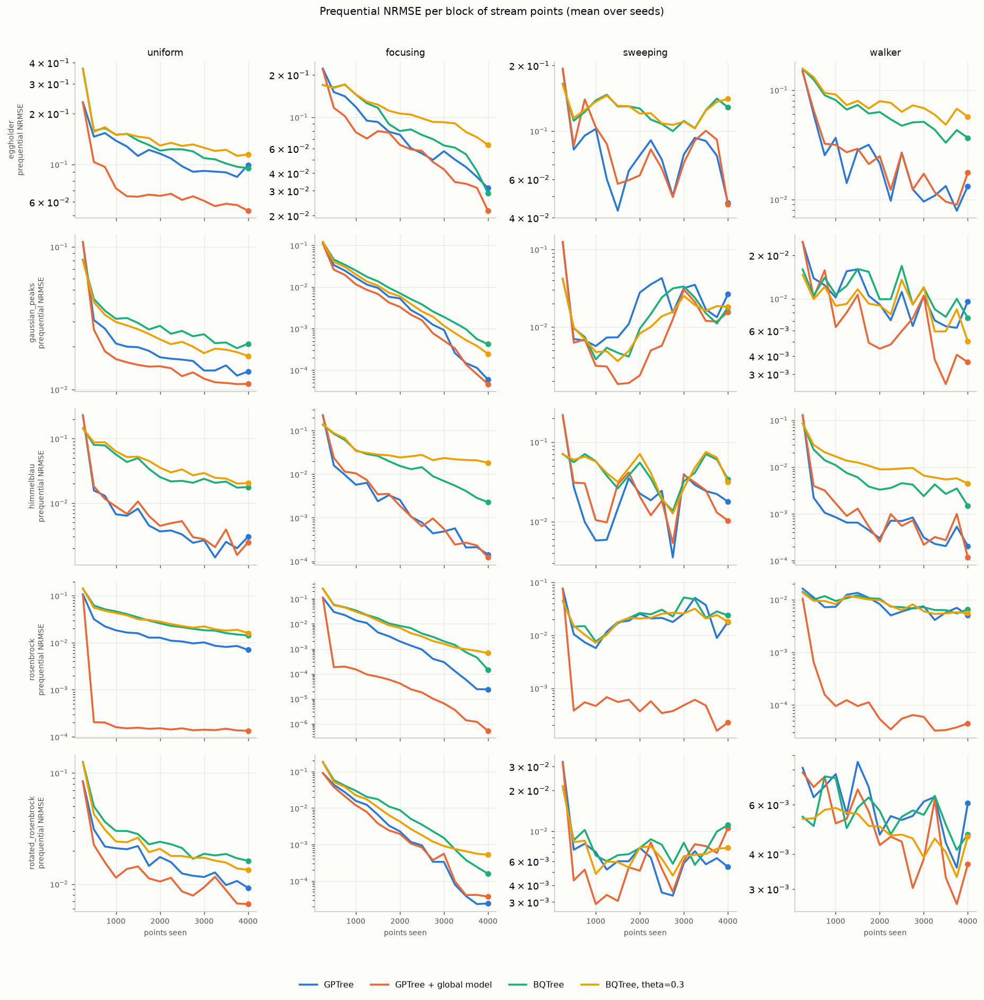

# BQTree (Bayesian quadratic leaves) vs GPTree, with and without the global model

Question: how far does a cheap parametric leaf get? `BQTree` keeps GPTree's partition,
routing, mixture-of-experts prediction and per-leaf calibration, but replaces the leaf GP
by a Bayesian quadratic regression with exact rank-one updates and no hyperparameter
optimisation. It is compared with the plain `GPTree` (`tree`) and with
`GPTree(global_mean='additive_gp')` (`global`) under the four input streams of
`BENCHMARK_RESULTS_global_mean_streams.md`.

Short answer: BQTree is 10x cheaper per update and 6x cheaper per prediction than the
plain tree (65x and 25x cheaper than the global-model tree), is calibrated on the stream
just as well, and is better calibrated off the stream. Its accuracy is 20 to 50 % worse
than the plain tree on the 6-dimensional targets at 4000 points (the gap shrinks to 15 to
35 % at 20000 points and closes in 10 dimensions), level on the rough 2-D Eggholder, and
an order of magnitude worse on the smooth 2-D Himmelblau, where a GP with 100 points in a
leaf is nearly exact and a quadratic is not. The global-model tree has the lowest
cube-wide error in 18 of 20 cells and the lowest on-stream error in 13, at the highest
cost. Nothing in the parametric leaf
compensates for what the GP leaf does well: interpolate a smooth function to high
accuracy from a few dozen points with fitted length scales.

## Setup

`examples/benchmark_bqtree.py`, 4000 points per stream, 3 seeds per cell, one core per run.

* Targets: `RotatedRosenbrock` and `GaussianPeaks` (6-D, non-additive), `Rosenbrock`
  (6-D, additive), `Eggholder` and `Himmelblau` (2-D). Observation noise passed to the
  models: 1e-3 relative (no noise added to the targets).
* Streams (`examples/input_streams.py`, same definitions as the global-model benchmark):
  `uniform`, `focusing` (broad phase, then a cluster shrinking around the minimum),
  `sweeping` (a cluster moving along a path), `walker` (all proposals of a Metropolis walk).
* `tree`: `GPTree(Default_GPR(n_restarts_optimizer=1), Nbar=100, theta=1e-4,
  retrain_every_n_points=25, splitting_strategy='gradual', use_calibrated_sigma=True)`.
* `global`: the same with `global_mean=AdditiveGPGlobalMean(reservoir_size=500,
  min_points=200, min_turnover=0.25, n_restarts_optimizer=2)`.
* `bq`: `BQTree(Nbar=100, theta=1e-4, degree=2, split_criterion='rss', rebuild_every=10,
  clip_margin=0.5, use_calibrated_sigma=True)`. `bq:theta=0.3`: the same with a wide leaf
  overlap (linear blending of neighbouring leaves). `bq:fit_margin=0.1+theta=0.3`: in
  addition every point also enters the fit of the leaves whose cell, widened by 10 %,
  contains it.
* Metrics as before: NRMSE (RMSE / range of the target on a uniform sample) prequentially
  on the stream after the first 666 points, on a 3000-point uniform test set and on a
  3000-point focus test set drawn where the stream ended; 1-sigma coverage (target 0.68)
  and RMS sigma / RMSE for the three; mean update and single-point prediction time.

## The BQTree leaf

`pygptreeo/bqtree.py`. Each leaf holds a Bayesian linear regression on the monomials up
to degree 2 of leaf-local standardised coordinates (p = 28 coefficients in 6-D, 66 in
10-D), prior `N(0, s * diag(v_order))`, per-point noise variance `sigma_i^2 + tau^2`.

* A new point enters the posterior by a rank-one (recursive least squares) update,
  O(p^2). Every 10 points the leaf re-solves from its stored points: it re-centres its
  coordinates, re-estimates the misfit variance `tau^2` from the in-sample residuals
  (corrected for the fitted degrees of freedom) and picks the prior scale `s` by marginal
  likelihood on a 6-point grid. Re-solving every point instead changes nothing measurable.
* Predicted sigma = posterior standard deviation of the polynomial plus `tau^2`, then the
  same residual-quantile calibration scaler as GPTree.
* Beyond 0.5 standardised units outside the range of its fitted points, a leaf holds its
  polynomial constant per dimension and adds the squared clipped distance (in units of its
  output variance) to the predictive variance (`clip_margin`). Without this, quadratic
  extrapolation into unvisited regions produced uniform-test NRMSE of 23 on the Eggholder
  walker stream (0.59 with clipping) and 1.9 on the Himmelblau walker stream (0.14).
  Clipping is neutral on the uniform and focusing streams, helps on the sweeping streams
  (10 to 40 % lower cube-wide error) and costs 20 to 50 % on the walker streams of the
  three 6-D targets, where a gentle polynomial extrapolation was better than a constant.
  The unclipped results are kept under `results/bqtree/unclipped/`.
* Splits at `Nbar` own points, on the dimension whose median split most reduces the two
  children's residual sum of squares (`rss`); the widest-dimension rule is 12 % worse.
  Children get the parent's points on their side and are re-solved.

Settings explored before the grid (rotated Rosenbrock and Gaussian peaks, uniform stream,
2000 points): linear leaves are 2x worse than quadratic; `Nbar` 40 or 60 is worse than 100
(a 28-coefficient quadratic needs more than 30 points), 150 to 200 is level; `theta=0.3`
gains 15 % accuracy; margin sharing gains 7 to 11 % for double the update cost; the prior
scale selection and the rebuild period make no measurable difference.

## Results at a glance (mean over 3 seeds; full table at the end)

Prequential NRMSE on the stream / NRMSE on the uniform test set:

| target | stream | tree | global | bq | bq:theta=0.3 |
|---|---|---|---|---|---|
| rotated_rosenbrock | uniform | 0.0155 / 0.0109 | **0.0107 / 0.0077** | 0.0230 / 0.0159 | 0.0196 / 0.0136 |
| rotated_rosenbrock | focusing | 0.0069 / 0.0301 | **0.0053 / 0.0177** | 0.0133 / 0.0394 | 0.0103 / 0.0360 |
| rotated_rosenbrock | sweeping | **0.0060** / 0.0647 | 0.0065 / **0.0530** | 0.0078 / 0.0700 | 0.0066 / 0.0620 |
| rotated_rosenbrock | walker | 0.0062 / 0.0923 | **0.0049 / 0.0760** | 0.0057 / 0.0973 | **0.0049** / 0.0935 |
| gaussian_peaks | uniform | 0.0168 / 0.0139 | **0.0135 / 0.0112** | 0.0258 / 0.0212 | 0.0226 / 0.0167 |
| gaussian_peaks | focusing | 0.0074 / 0.0232 | **0.0054 / 0.0169** | 0.0109 / 0.0367 | 0.0088 / 0.0309 |
| gaussian_peaks | sweeping | 0.0264 / 0.0807 | **0.0130 / 0.0423** | 0.0185 / 0.0985 | 0.0142 / 0.0948 |
| gaussian_peaks | walker | 0.0111 / 0.1063 | **0.0073 / 0.0624** | 0.0120 / 0.1247 | 0.0097 / 0.1117 |
| rosenbrock | uniform | 0.0124 / 0.0080 | **0.0001 / 0.0001** | 0.0275 / 0.0144 | 0.0276 / 0.0164 |
| eggholder | uniform | 0.1086 / 0.0910 | **0.0643 / 0.0535** | 0.1233 / 0.0928 | 0.1334 / 0.1133 |
| himmelblau | uniform | **0.0046 / 0.0017** | 0.0059 / 0.0029 | 0.0331 / 0.0145 | 0.0392 / 0.0219 |

Ratios to the plain tree (mean over seeds of the per-seed ratio; below 1 is better):
prequential / uniform-test / focus-test.

| target | stream | global | bq | bq:theta=0.3 |
|---|---|---|---|---|
| rotated_rosenbrock | uniform | 0.70 / 0.71 / 0.69 | 1.49 / 1.47 / 1.53 | 1.27 / 1.26 / 1.26 |
| rotated_rosenbrock | focusing | 0.75 / 0.59 / floor | 1.95 / 1.31 / floor | 1.52 / 1.20 / floor |
| rotated_rosenbrock | sweeping | 1.11 / 0.82 / 1.94 | 1.32 / 1.08 / 1.90 | 1.10 / 0.96 / 1.26 |
| rotated_rosenbrock | walker | 0.78 / 0.82 / 0.47 | 0.92 / 1.05 / 0.90 | 0.78 / 1.01 / 0.88 |
| gaussian_peaks | uniform | 0.81 / 0.81 / 0.84 | 1.54 / 1.53 / 1.57 | 1.35 / 1.21 / 1.26 |
| gaussian_peaks | focusing | 0.74 / 0.73 / floor | 1.50 / 1.58 / floor | 1.20 / 1.33 / floor |
| gaussian_peaks | sweeping | 0.50 / 0.52 / 0.69 | 0.72 / 1.22 / 1.32 | 0.54 / 1.18 / 1.17 |
| gaussian_peaks | walker | 0.65 / 0.59 / 0.36 | 1.10 / 1.17 / 1.16 | 0.89 / 1.05 / 1.03 |
| rosenbrock | uniform | 0.01 / 0.02 / 0.02 | 2.22 / 1.80 / 1.79 | 2.23 / 2.05 / 2.09 |
| rosenbrock | sweeping | 0.02 / 0.00 / 0.02 | 1.17 / 1.18 / 3.86 | 0.89 / 1.02 / 0.95 |
| rosenbrock | walker | 0.01 / 0.01 / 0.01 | 1.02 / 1.22 / 1.33 | 1.00 / 1.22 / 1.33 |
| eggholder | uniform | 0.61 / 0.61 / 0.62 | 1.18 / 1.09 / 1.07 | 1.28 / 1.32 / 1.31 |
| eggholder | sweeping | 1.04 / 0.79 / 1.13 | 1.62 / 1.40 / 2.59 | 1.62 / 1.28 / 2.72 |
| eggholder | walker | 1.18 / 0.77 / 0.69 | 2.52 / 2.51 / 3.26 | 3.14 / 1.21 / 5.89 |
| himmelblau | uniform | 1.30 / 2.05 / 2.10 | 7.64 / 9.45 / 10.21 | 9.16 / 14.21 / 13.96 |
| himmelblau | sweeping | 1.07 / 0.39 / 0.88 | 1.91 / 0.78 / 4.72 | 2.02 / 0.76 / 5.72 |
| himmelblau | walker | 1.48 / 0.68 / 0.25 | 9.31 / 0.50 / 7.03 | 17.31 / 0.51 / 41.02 |

"floor": in the focusing streams every configuration reaches a focus-test NRMSE of 1e-4
or below, and ratios there are noise on numbers at the resolution floor. Geometric mean
over all 20 cells (prequential / uniform / focus): global 0.38 / 0.30 / 0.42, bq 1.88 /
1.53 / 3.06, bq:theta=0.3 1.84 / 1.45 / 3.69; the additive Rosenbrock (where the global
model is exact) and the Himmelblau dominate these means.

Cost and calibration, averaged over the 60 runs of each configuration:

| config | update ms/point | predict ms/point | s per 4000-point run | coverage on stream | coverage uniform test | coverage focus test |
|---|---|---|---|---|---|---|
| tree | 5.6 | 0.83 | 27 | 0.67 | 0.49 | 0.68 |
| global | 34.8 | 3.06 | 176 | 0.68 | 0.47 | 0.69 |
| bq | 0.53 | 0.13 | 3 | 0.67 | 0.61 | 0.69 |
| bq:theta=0.3 | 0.52 | 0.40 | 4 | 0.89 | 0.78 | 0.94 |
| bq:fit_margin=0.1+theta=0.3 | 1.04 | 0.42 | 6 | 0.88 | 0.75 | 0.93 |



## Reading

**Cost.** The update cost of the quadratic leaf is 0.5 ms per point in 6-D, against 5.6
ms for the GP leaf (refit with L-BFGS every 25 points) and 35 ms with the global model
(whose per-point cost is dominated by evaluating the 500-point global GP). Prediction is
0.13 ms against 0.83 and 3.1 ms. A 20000-point stream takes 17 s, 127 s and 512 s. These
are the ratios the design was built for and they hold on every target and stream.

**Accuracy on the 6-D targets.** At 4000 points the plain quadratic tree is 30 to 55 %
worse than the GP tree on uniform and focusing streams and level with it on the walker
streams (ratios 0.92 to 1.10); on the sweeping streams it is worse on the rotated
Rosenbrock (1.3x) and better on the Gaussian peaks (0.72x). The blended variant
(`theta=0.3`) is 15 to 25 % better than the plain one and ends level with or slightly
better than the GP tree on the sweeping and walker streams. The global-model tree is
better than both in every 6-D cell except the sweeping rotated Rosenbrock (and a tie with
the blended variant on its walker stream), by 20 to 50 %.

**Accuracy in 2-D.** Himmelblau is a smooth quartic, and 100 points per leaf make the GP
leaf almost exact (uniform-test NRMSE 0.0017); the quadratic leaf stays at 0.0145. This is
the regime where a nonparametric leaf earns its cost. On the rough Eggholder neither leaf
model does well (0.09 for both) and only the global model helps (0.054).

**Additive structure.** On the (unrotated) Rosenbrock the global additive GP is exact to
1e-4 and both trees are two orders of magnitude behind. A quadratic leaf has no way to
exploit additive structure across leaves; a global model does.

**Sample efficiency along the stream** (figure). The learning curves of the quadratic
trees run parallel to the GP tree's from the first block on, at a constant factor above
it, on every 6-D target; they do not start slower and catch up. In 2-D the GP tree pulls
away with every block. With the global model the curve drops in the first 500 points and
stays below the others.

**Scaling with N** (rotated Rosenbrock, uniform, one seed): at 20000 points the
uniform-test NRMSE is 0.0053 (tree), 0.0038 (global), 0.0072 (bq) and 0.0060
(bq:theta=0.3), i.e. the quadratic tree's deficit shrinks from 47 % at 4000 points to 36 %,
and from 26 % to 13 % for the blended variant; leaves shrink, and a quadratic per leaf
becomes a better approximation faster than the GP leaf improves.

**Dimension 10** (rotated Rosenbrock, 2 seeds): with `Nbar=100` a leaf's 50 own points
cannot determine 66 coefficients and the quadratic tree is 2.3x worse than the GP tree.
With `Nbar=200` it is level on the uniform stream (0.061 vs 0.054) and better on the
sweeping stream (prequential 0.021 vs 0.037, uniform 0.12 vs 0.13), at 0.8 ms per update
against 7 to 8 ms. The global model is best again (0.045 uniform; 0.091 sweeping) at 95
ms per update.

**Uncertainty.** All configurations are calibrated on the stream (coverage 0.66 to 0.68
for tree, global and bq). Off the stream the quadratic tree is the better calibrated one
(uniform-test coverage 0.61 against 0.49 and 0.47): its variance grows with the distance
from the leaf's data, while the GP leaf's extrapolation variance saturates and the
calibration scaler, fitted prequentially, cannot know about unvisited regions. The
blended variants are over-conservative (coverage 0.89 on the stream, RMS sigma / RMSE
1.5): the mixture variance adds the disagreement between neighbouring leaves, which the
per-leaf calibration cannot remove. In the focus region of a focusing stream this
disagreement term can be large (sigma / RMSE up to 10 on the rotated Rosenbrock); without
clipping it was up to 5000, from a neighbour's quadratic extrapolated across the cluster.

**What did not work.** Linear leaves; small leaves; margin sharing (small gain, double
cost); free polynomial extrapolation. The remaining gap on smooth targets is the leaf
model itself: within a cell a quadratic has an O(h^3) bias that a GP with fitted length
scales does not have, and the tree can only remove it by splitting further, which costs
data.

## Defects found on the way

* `GPNode.compute_split_position_and_overlap` set `overlap = theta * spread`, which is 0
  when all points of a leaf coincide along the split dimension, and `prob_func` then
  divides by zero. The focusing Eggholder stream triggers this (its minimum is on the
  domain boundary, so the shrinking cluster is clipped to a line). The overlap is now
  floored (`MIN_OVERLAP`); with a zero spread the split puts the coinciding points on
  either side with probability 1/2.

## Reproduce

```bash
# main grid (5 targets x 4 streams x {tree, global} x 3 seeds, then the BQTree configs)
for t in rotated_rosenbrock gaussian_peaks rosenbrock; do
  python examples/benchmark_bqtree.py --target $t --d 6 --configs tree,global --seeds 1,2,3 --out results/bqtree/$t.jsonl
  python examples/benchmark_bqtree.py --target $t --d 6 --configs 'bq,bq:theta=0.3,bq:fit_margin=0.1+theta=0.3' --seeds 1,2,3 --out results/bqtree/$t.jsonl
done
for t in eggholder himmelblau; do  # the same with --d 2
  python examples/benchmark_bqtree.py --target $t --d 2 --configs tree,global --seeds 1,2,3 --out results/bqtree/$t.jsonl
  python examples/benchmark_bqtree.py --target $t --d 2 --configs 'bq,bq:theta=0.3,bq:fit_margin=0.1+theta=0.3' --seeds 1,2,3 --out results/bqtree/$t.jsonl
done
# scaling and dimension
python examples/benchmark_bqtree.py --target rotated_rosenbrock --N 20000 --streams uniform --configs 'tree,global,bq,bq:theta=0.3' --out results/bqtree/scaling.jsonl
python examples/benchmark_bqtree.py --target rotated_rosenbrock --d 10 --streams uniform,sweeping --configs 'tree,global,bq,bq:Nbar=200,bq:Nbar=200+theta=0.3' --seeds 1,2 --out results/bqtree/d10.jsonl
# tables and figure
python examples/benchmark_bqtree.py --summarize results/bqtree/*.jsonl --curves
python examples/plot_bqtree_curves.py results/bqtree/*.jsonl
```

Raw result lines: `examples/results/bqtree/*.jsonl` (one file per target, stream,
configuration family and seed; `scaling_*` and `d10_*` for the two extra experiments;
`unclipped/` for the BQTree runs before clipped extrapolation).

## Full table (main grid)

| target | stream | config | seeds | prequential NRMSE | uniform-test NRMSE | focus-test NRMSE | coverage preq / uni / focus | sigma/RMSE preq / uni / focus | update ms | predict ms | leaves | time [s] |
|---|---|---|---|---|---|---|---|---|---|---|---|---|
| eggholder | focusing | bq | 3 | 0.0931 (0.0721..0.1055) | 0.1431 (0.1334..0.1535) | 0.0347 (0.0032..0.0550) | 0.68 (0.66..0.70) / 0.72 (0.70..0.76) / 0.69 (0.67..0.73) | 1.01 (0.96..1.05) / 1.15 (1.10..1.21) / 1.00 (0.95..1.06) | 0.50 | 0.15 | 60 | 3 |
| eggholder | focusing | bq:fit_margin=0.1+theta=0.3 | 3 | 0.1086 (0.0721..0.1294) | 0.1446 (0.1352..0.1558) | 0.0679 (0.0049..0.1060) | 0.86 (0.82..0.92) / 0.77 (0.75..0.79) / 0.94 (0.89..1.00) | 7.83 (1.62..16.11) / 1.26 (1.24..1.28) / 3.32 (1.53..4.95) | 0.80 | 0.37 | 60 | 5 |
| eggholder | focusing | bq:theta=0.3 | 3 | 0.1101 (0.0750..0.1306) | 0.1444 (0.1370..0.1537) | 0.0688 (0.0049..0.1113) | 0.85 (0.82..0.91) / 0.77 (0.76..0.80) / 0.93 (0.89..1.00) | 3.78 (1.34..8.61) / 1.23 (1.19..1.29) / 4.10 (1.48..6.83) | 0.50 | 0.37 | 60 | 4 |
| eggholder | focusing | global | 3 | 0.0605 (0.0257..0.0839) | 0.0673 (0.0632..0.0735) | 0.0319 (0.0048..0.0517) | 0.73 (0.71..0.75) / 0.66 (0.33..0.92) / 0.71 (0.69..0.72) | 0.83 (0.75..0.91) / 1.32 (0.19..2.72) / 0.98 (0.75..1.12) | 9.83 | 1.80 | 60 | 59 |
| eggholder | focusing | tree | 3 | 0.0760 (0.0271..0.1254) | 0.1266 (0.1187..0.1386) | 0.0312 (0.0002..0.0753) | 0.71 (0.69..0.71) / 0.71 (0.67..0.78) / 0.68 (0.67..0.68) | 0.98 (0.91..1.07) / 1.36 (1.00..2.00) / 0.99 (0.37..1.41) | 4.54 | 1.18 | 60 | 24 |
| eggholder | sweeping | bq | 3 | 0.1249 (0.1213..0.1269) | 0.1509 (0.1274..0.1634) | 0.1257 (0.1152..0.1448) | 0.67 (0.66..0.68) / 0.69 (0.66..0.71) / 0.72 (0.64..0.77) | 0.98 (0.95..0.99) / 0.97 (0.83..1.07) / 1.11 (0.81..1.28) | 0.50 | 0.14 | 61 | 3 |
| eggholder | sweeping | bq:fit_margin=0.1+theta=0.3 | 3 | 0.1282 (0.1247..0.1302) | 0.1525 (0.1460..0.1589) | 0.1317 (0.1238..0.1364) | 0.74 (0.73..0.75) / 0.79 (0.78..0.80) / 0.78 (0.73..0.82) | 1.11 (1.09..1.13) / 1.08 (0.99..1.14) / 1.25 (1.13..1.33) | 0.73 | 0.27 | 60 | 4 |
| eggholder | sweeping | bq:theta=0.3 | 3 | 0.1252 (0.1226..0.1280) | 0.1403 (0.1270..0.1481) | 0.1325 (0.1292..0.1372) | 0.75 (0.74..0.76) / 0.81 (0.80..0.83) / 0.77 (0.75..0.79) | 1.15 (1.12..1.18) / 1.22 (1.12..1.36) / 1.23 (1.16..1.30) | 0.50 | 0.26 | 60 | 3 |
| eggholder | sweeping | global | 3 | 0.0805 (0.0794..0.0820) | 0.0859 (0.0802..0.0926) | 0.0548 (0.0458..0.0632) | 0.68 (0.66..0.69) / 0.61 (0.57..0.65) / 0.67 (0.60..0.74) | 0.75 (0.69..0.79) / 0.70 (0.61..0.82) / 0.70 (0.56..0.85) | 24.59 | 2.66 | 60 | 126 |
| eggholder | sweeping | tree | 3 | 0.0773 (0.0759..0.0786) | 0.1101 (0.0945..0.1222) | 0.0493 (0.0452..0.0562) | 0.69 (0.69..0.70) / 0.64 (0.61..0.68) / 0.71 (0.68..0.75) | 0.77 (0.70..0.85) / 0.62 (0.46..0.75) / 0.81 (0.58..1.28) | 3.78 | 0.78 | 61 | 20 |
| eggholder | uniform | bq | 3 | 0.1233 (0.1199..0.1255) | 0.0928 (0.0926..0.0931) | 0.0931 (0.0913..0.0964) | 0.67 (0.66..0.67) / 0.68 (0.66..0.69) / 0.67 (0.67..0.68) | 1.03 (1.03..1.04) / 1.09 (1.07..1.10) / 1.08 (1.07..1.09) | 0.45 | 0.12 | 61 | 2 |
| eggholder | uniform | bq:fit_margin=0.1+theta=0.3 | 3 | 0.1299 (0.1287..0.1315) | 0.1053 (0.1032..0.1082) | 0.1054 (0.1022..0.1096) | 0.75 (0.74..0.76) / 0.81 (0.80..0.82) / 0.81 (0.79..0.82) | 1.19 (1.19..1.20) / 1.33 (1.31..1.35) / 1.33 (1.30..1.35) | 0.67 | 0.26 | 61 | 4 |
| eggholder | uniform | bq:theta=0.3 | 3 | 0.1334 (0.1293..0.1393) | 0.1133 (0.1066..0.1205) | 0.1137 (0.1079..0.1230) | 0.74 (0.73..0.75) / 0.78 (0.76..0.80) / 0.77 (0.74..0.80) | 1.19 (1.17..1.20) / 1.26 (1.20..1.33) / 1.26 (1.18..1.30) | 0.46 | 0.25 | 61 | 3 |
| eggholder | uniform | global | 3 | 0.0643 (0.0608..0.0711) | 0.0535 (0.0451..0.0637) | 0.0549 (0.0455..0.0642) | 0.70 (0.68..0.72) / 0.73 (0.70..0.76) / 0.73 (0.70..0.76) | 0.76 (0.72..0.83) / 0.81 (0.73..0.88) / 0.77 (0.68..0.85) | 14.48 | 2.73 | 60 | 88 |
| eggholder | uniform | tree | 3 | 0.1086 (0.0803..0.1279) | 0.0910 (0.0627..0.1135) | 0.0918 (0.0635..0.1139) | 0.69 (0.68..0.69) / 0.69 (0.68..0.70) / 0.69 (0.67..0.69) | 1.01 (1.00..1.02) / 0.95 (0.87..1.02) / 0.93 (0.87..1.01) | 3.35 | 0.72 | 59 | 18 |
| eggholder | walker | bq | 3 | 0.0573 (0.0150..0.0816) | 0.5860 (0.2731..1.0061) | 0.0268 (0.0009..0.0429) | 0.67 (0.65..0.70) / 0.91 (0.87..0.95) / 0.67 (0.65..0.68) | 0.93 (0.78..1.04) / 5.21 (3.00..8.79) / 0.88 (0.80..0.93) | 0.48 | 0.13 | 60 | 3 |
| eggholder | walker | bq:fit_margin=0.1+theta=0.3 | 3 | 0.0718 (0.0190..0.0986) | 0.4006 (0.1773..0.5883) | 0.0465 (0.0012..0.0718) | 0.91 (0.87..0.96) / 0.96 (0.92..0.99) / 0.96 (0.92..1.00) | 1.56 (1.22..2.20) / 10.65 (4.73..20.15) / 6.50 (4.37..10.33) | 0.80 | 0.37 | 59 | 5 |
| eggholder | walker | bq:theta=0.3 | 3 | 0.0718 (0.0178..0.0993) | 0.3205 (0.1960..0.5044) | 0.0534 (0.0014..0.0796) | 0.91 (0.88..0.96) / 0.97 (0.96..0.99) / 0.97 (0.95..1.00) | 2.28 (1.23..4.23) / 12.14 (7.53..18.30) / 10.04 (1.56..24.13) | 0.51 | 0.36 | 59 | 4 |
| eggholder | walker | global | 3 | 0.0235 (0.0106..0.0300) | 0.2254 (0.1737..0.3105) | 0.0094 (0.0000..0.0147) | 0.60 (0.42..0.70) / 0.08 (0.01..0.20) / 0.54 (0.17..0.75) | 0.36 (0.06..0.55) / 0.10 (0.00..0.25) / 0.67 (0.46..0.88) | 22.20 | 2.98 | 59 | 115 |
| eggholder | walker | tree | 3 | 0.0220 (0.0077..0.0358) | 0.3111 (0.2025..0.4934) | 0.0096 (0.0002..0.0166) | 0.68 (0.66..0.71) / 0.36 (0.16..0.48) / 0.70 (0.67..0.74) | 0.34 (0.04..0.53) / 0.50 (0.27..0.62) / 0.40 (0.13..0.74) | 3.90 | 0.78 | 60 | 20 |
| gaussian_peaks | focusing | bq | 3 | 0.0109 (0.0106..0.0114) | 0.0367 (0.0340..0.0415) | 0.0006 (0.0003..0.0009) | 0.68 (0.67..0.69) / 0.50 (0.43..0.55) / 0.67 (0.63..0.73) | 0.99 (0.96..1.02) / 0.63 (0.53..0.69) / 0.99 (0.95..1.06) | 0.53 | 0.13 | 60 | 3 |
| gaussian_peaks | focusing | bq:fit_margin=0.1+theta=0.3 | 3 | 0.0081 (0.0069..0.0088) | 0.0281 (0.0234..0.0337) | 0.0003 (0.0002..0.0005) | 0.96 (0.95..0.98) / 0.64 (0.58..0.69) / 1.00 (1.00..1.00) | 1.54 (1.44..1.72) / 0.92 (0.76..1.07) / 7.17 (6.45..8.18) | 1.96 | 0.94 | 59 | 12 |
| gaussian_peaks | focusing | bq:theta=0.3 | 3 | 0.0088 (0.0082..0.0093) | 0.0309 (0.0291..0.0340) | 0.0003 (0.0002..0.0005) | 0.97 (0.97..0.98) / 0.74 (0.69..0.80) / 1.00 (1.00..1.00) | 1.78 (1.69..1.92) / 1.15 (1.05..1.23) / 8.80 (6.56..12.11) | 0.56 | 0.89 | 59 | 6 |
| gaussian_peaks | focusing | global | 3 | 0.0054 (0.0044..0.0062) | 0.0169 (0.0158..0.0181) | 0.0001 (0.0001..0.0002) | 0.74 (0.73..0.75) / 0.34 (0.20..0.46) / 0.65 (0.62..0.67) | 0.93 (0.91..0.94) / 0.35 (0.22..0.45) / 1.36 (1.00..1.61) | 22.08 | 2.01 | 60 | 124 |
| gaussian_peaks | focusing | tree | 3 | 0.0074 (0.0064..0.0081) | 0.0232 (0.0213..0.0254) | 0.0001 (0.0001..0.0002) | 0.70 (0.69..0.70) / 0.54 (0.49..0.60) / 0.63 (0.60..0.66) | 1.00 (0.98..1.03) / 0.68 (0.55..0.77) / 0.80 (0.73..0.91) | 6.12 | 0.82 | 60 | 29 |
| gaussian_peaks | sweeping | bq | 3 | 0.0185 (0.0160..0.0198) | 0.0985 (0.0945..0.1015) | 0.0154 (0.0120..0.0180) | 0.67 (0.66..0.67) / 0.69 (0.64..0.75) / 0.69 (0.66..0.72) | 1.89 (1.65..2.05) / 2.17 (2.01..2.48) / 1.51 (0.98..1.90) | 0.57 | 0.14 | 60 | 3 |
| gaussian_peaks | sweeping | bq:fit_margin=0.1+theta=0.3 | 3 | 0.0125 (0.0116..0.0133) | 0.0776 (0.0693..0.0829) | 0.0108 (0.0094..0.0116) | 0.90 (0.89..0.90) / 0.81 (0.78..0.86) / 0.94 (0.92..0.95) | 2.82 (1.96..3.77) / 2.35 (2.28..2.50) / 1.87 (1.67..1.99) | 0.94 | 0.27 | 60 | 5 |
| gaussian_peaks | sweeping | bq:theta=0.3 | 3 | 0.0142 (0.0115..0.0173) | 0.0948 (0.0847..0.1049) | 0.0130 (0.0124..0.0134) | 0.91 (0.90..0.92) / 0.82 (0.80..0.84) / 0.94 (0.91..0.96) | 2.96 (2.56..3.18) / 1.94 (1.76..2.07) / 2.21 (1.75..2.62) | 0.57 | 0.28 | 58 | 4 |
| gaussian_peaks | sweeping | global | 3 | 0.0130 (0.0119..0.0149) | 0.0423 (0.0419..0.0428) | 0.0077 (0.0072..0.0084) | 0.67 (0.67..0.68) / 0.42 (0.39..0.45) / 0.73 (0.68..0.76) | 0.78 (0.74..0.80) / 0.43 (0.34..0.49) / 0.94 (0.61..1.37) | 59.18 | 3.48 | 61 | 279 |
| gaussian_peaks | sweeping | tree | 3 | 0.0264 (0.0230..0.0330) | 0.0807 (0.0787..0.0842) | 0.0117 (0.0085..0.0138) | 0.65 (0.64..0.65) / 0.50 (0.46..0.55) / 0.77 (0.75..0.80) | 0.75 (0.71..0.82) / 0.74 (0.54..1.04) / 1.14 (0.65..1.48) | 6.75 | 0.93 | 61 | 32 |
| gaussian_peaks | uniform | bq | 3 | 0.0258 (0.0237..0.0272) | 0.0212 (0.0193..0.0221) | 0.0211 (0.0186..0.0225) | 0.67 (0.66..0.67) / 0.66 (0.63..0.68) / 0.65 (0.63..0.68) | 0.88 (0.85..0.91) / 0.86 (0.81..0.91) / 0.87 (0.81..0.94) | 0.54 | 0.12 | 60 | 3 |
| gaussian_peaks | uniform | bq:fit_margin=0.1+theta=0.3 | 3 | 0.0214 (0.0194..0.0227) | 0.0171 (0.0165..0.0175) | 0.0173 (0.0163..0.0179) | 0.83 (0.83..0.84) / 0.87 (0.86..0.88) / 0.86 (0.86..0.86) | 1.28 (1.23..1.30) / 1.46 (1.40..1.54) / 1.43 (1.38..1.48) | 0.91 | 0.28 | 58 | 5 |
| gaussian_peaks | uniform | bq:theta=0.3 | 3 | 0.0226 (0.0207..0.0243) | 0.0167 (0.0160..0.0175) | 0.0169 (0.0162..0.0175) | 0.87 (0.86..0.87) / 0.91 (0.90..0.91) / 0.90 (0.90..0.91) | 1.47 (1.42..1.52) / 1.73 (1.71..1.78) / 1.70 (1.65..1.76) | 0.55 | 0.27 | 60 | 4 |
| gaussian_peaks | uniform | global | 3 | 0.0135 (0.0126..0.0143) | 0.0112 (0.0106..0.0120) | 0.0113 (0.0106..0.0123) | 0.68 (0.67..0.70) / 0.67 (0.64..0.69) / 0.68 (0.67..0.70) | 0.87 (0.87..0.88) / 0.86 (0.79..0.92) / 0.86 (0.83..0.91) | 39.08 | 3.90 | 60 | 205 |
| gaussian_peaks | uniform | tree | 3 | 0.0168 (0.0162..0.0179) | 0.0139 (0.0129..0.0149) | 0.0135 (0.0127..0.0149) | 0.68 (0.67..0.68) / 0.66 (0.65..0.68) / 0.67 (0.66..0.68) | 0.93 (0.92..0.93) / 0.87 (0.85..0.89) / 0.90 (0.88..0.91) | 5.46 | 0.76 | 60 | 27 |
| gaussian_peaks | walker | bq | 3 | 0.0120 (0.0110..0.0140) | 0.1247 (0.1224..0.1263) | 0.0040 (0.0037..0.0046) | 0.67 (0.66..0.69) / 0.34 (0.30..0.37) / 0.79 (0.78..0.81) | 1.41 (1.07..1.95) / 0.59 (0.51..0.67) / 1.21 (1.16..1.30) | 0.53 | 0.12 | 60 | 3 |
| gaussian_peaks | walker | bq:fit_margin=0.1+theta=0.3 | 3 | 0.0086 (0.0077..0.0092) | 0.1057 (0.1022..0.1127) | 0.0038 (0.0026..0.0045) | 0.89 (0.88..0.92) / 0.41 (0.39..0.45) / 0.96 (0.94..0.97) | 1.78 (1.45..2.33) / 0.51 (0.44..0.56) / 2.03 (1.83..2.14) | 1.05 | 0.33 | 60 | 6 |
| gaussian_peaks | walker | bq:theta=0.3 | 3 | 0.0097 (0.0081..0.0114) | 0.1117 (0.1065..0.1189) | 0.0039 (0.0026..0.0048) | 0.92 (0.92..0.92) / 0.52 (0.49..0.54) / 0.98 (0.97..0.99) | 1.78 (1.71..1.87) / 0.68 (0.64..0.71) / 2.48 (2.06..2.77) | 0.52 | 0.32 | 59 | 4 |
| gaussian_peaks | walker | global | 3 | 0.0073 (0.0056..0.0093) | 0.0624 (0.0567..0.0698) | 0.0013 (0.0009..0.0016) | 0.66 (0.64..0.68) / 0.16 (0.12..0.23) / 0.87 (0.84..0.93) | 1.07 (0.97..1.20) / 0.09 (0.06..0.13) / 1.61 (1.16..2.27) | 54.11 | 4.88 | 59 | 270 |
| gaussian_peaks | walker | tree | 3 | 0.0111 (0.0100..0.0119) | 0.1063 (0.1053..0.1081) | 0.0039 (0.0021..0.0049) | 0.68 (0.67..0.68) / 0.20 (0.18..0.21) / 0.78 (0.73..0.81) | 0.86 (0.85..0.88) / 0.26 (0.24..0.28) / 0.95 (0.78..1.24) | 6.79 | 0.89 | 58 | 33 |
| himmelblau | focusing | bq | 3 | 0.0192 (0.0186..0.0196) | 0.0478 (0.0449..0.0496) | 0.0019 (0.0018..0.0020) | 0.65 (0.65..0.66) / 0.65 (0.60..0.68) / 0.67 (0.65..0.71) | 0.82 (0.74..0.92) / 0.87 (0.72..0.99) / 0.94 (0.90..1.03) | 0.47 | 0.13 | 59 | 2 |
| himmelblau | focusing | bq:fit_margin=0.1+theta=0.3 | 3 | 0.0255 (0.0245..0.0266) | 0.0564 (0.0524..0.0623) | 0.0099 (0.0096..0.0104) | 0.95 (0.95..0.96) / 0.89 (0.87..0.92) / 1.00 (1.00..1.00) | 1.78 (1.69..1.85) / 0.99 (0.89..1.15) / 3.75 (3.37..4.05) | 0.75 | 0.43 | 59 | 5 |
| himmelblau | focusing | bq:theta=0.3 | 3 | 0.0264 (0.0239..0.0279) | 0.0528 (0.0452..0.0603) | 0.0137 (0.0114..0.0162) | 0.95 (0.94..0.96) / 0.90 (0.88..0.93) / 1.00 (0.99..1.00) | 1.70 (1.55..1.95) / 1.11 (1.00..1.22) / 3.05 (2.87..3.27) | 0.46 | 0.41 | 58 | 4 |
| himmelblau | focusing | global | 3 | 0.0041 (0.0039..0.0044) | 0.0083 (0.0061..0.0103) | 0.0002 (0.0001..0.0003) | 0.71 (0.71..0.72) / 0.81 (0.74..0.88) / 0.70 (0.68..0.73) | 0.29 (0.19..0.42) / 0.48 (0.40..0.62) / 0.42 (0.23..0.53) | 15.24 | 1.73 | 59 | 82 |
| himmelblau | focusing | tree | 3 | 0.0031 (0.0025..0.0041) | 0.0066 (0.0047..0.0092) | 0.0002 (0.0002..0.0002) | 0.65 (0.64..0.66) / 0.67 (0.66..0.68) / 0.65 (0.65..0.66) | 0.25 (0.17..0.29) / 0.21 (0.09..0.30) / 0.49 (0.39..0.61) | 4.00 | 0.83 | 59 | 21 |
| himmelblau | sweeping | bq | 3 | 0.0463 (0.0400..0.0508) | 0.0807 (0.0502..0.1074) | 0.0319 (0.0192..0.0422) | 0.66 (0.65..0.67) / 0.62 (0.61..0.64) / 0.72 (0.68..0.76) | 0.91 (0.79..1.04) / 0.60 (0.52..0.66) / 1.05 (0.88..1.16) | 0.50 | 0.14 | 61 | 3 |
| himmelblau | sweeping | bq:fit_margin=0.1+theta=0.3 | 3 | 0.0476 (0.0422..0.0506) | 0.0775 (0.0501..0.0959) | 0.0364 (0.0230..0.0432) | 0.86 (0.85..0.86) / 0.84 (0.82..0.85) / 0.92 (0.91..0.94) | 0.98 (0.90..1.09) / 0.61 (0.48..0.75) / 1.16 (1.01..1.35) | 0.70 | 0.25 | 61 | 4 |
| himmelblau | sweeping | bq:theta=0.3 | 3 | 0.0488 (0.0433..0.0543) | 0.0778 (0.0544..0.1032) | 0.0338 (0.0218..0.0451) | 0.87 (0.86..0.89) / 0.84 (0.83..0.85) / 0.94 (0.93..0.94) | 1.02 (0.94..1.12) / 0.66 (0.57..0.82) / 1.26 (1.21..1.34) | 0.47 | 0.25 | 62 | 3 |
| himmelblau | sweeping | global | 3 | 0.0260 (0.0233..0.0278) | 0.0366 (0.0337..0.0390) | 0.0060 (0.0045..0.0087) | 0.69 (0.68..0.70) / 0.62 (0.61..0.64) / 0.61 (0.58..0.66) | 0.20 (0.13..0.32) / 0.33 (0.03..0.64) / 0.62 (0.08..1.47) | 28.13 | 2.23 | 62 | 137 |
| himmelblau | sweeping | tree | 3 | 0.0244 (0.0218..0.0259) | 0.1056 (0.0626..0.1341) | 0.0258 (0.0029..0.0697) | 0.67 (0.66..0.68) / 0.59 (0.58..0.59) / 0.60 (0.51..0.66) | 0.28 (0.15..0.37) / 0.25 (0.14..0.44) / 0.53 (0.21..0.74) | 4.07 | 0.81 | 60 | 21 |
| himmelblau | uniform | bq | 3 | 0.0331 (0.0302..0.0347) | 0.0145 (0.0133..0.0168) | 0.0138 (0.0128..0.0144) | 0.65 (0.64..0.65) / 0.66 (0.64..0.67) / 0.66 (0.66..0.67) | 0.80 (0.77..0.85) / 0.85 (0.74..0.99) / 0.87 (0.71..1.07) | 0.46 | 0.12 | 58 | 2 |
| himmelblau | uniform | bq:fit_margin=0.1+theta=0.3 | 3 | 0.0391 (0.0369..0.0429) | 0.0221 (0.0205..0.0253) | 0.0203 (0.0185..0.0214) | 0.92 (0.91..0.93) / 0.96 (0.95..0.97) / 0.96 (0.95..0.97) | 1.24 (1.18..1.29) / 1.49 (1.42..1.62) / 1.63 (1.37..1.83) | 0.69 | 0.27 | 59 | 4 |
| himmelblau | uniform | bq:theta=0.3 | 3 | 0.0392 (0.0379..0.0416) | 0.0219 (0.0216..0.0223) | 0.0195 (0.0174..0.0224) | 0.92 (0.91..0.93) / 0.96 (0.96..0.96) / 0.96 (0.96..0.97) | 1.23 (1.20..1.29) / 1.45 (1.28..1.62) / 1.67 (1.21..2.07) | 0.46 | 0.26 | 61 | 3 |
| himmelblau | uniform | global | 3 | 0.0059 (0.0050..0.0075) | 0.0029 (0.0012..0.0041) | 0.0026 (0.0021..0.0029) | 0.68 (0.67..0.70) / 0.68 (0.59..0.73) / 0.68 (0.59..0.73) | 0.29 (0.26..0.31) / 0.33 (0.26..0.40) / 0.36 (0.15..0.54) | 18.57 | 2.47 | 58 | 101 |
| himmelblau | uniform | tree | 3 | 0.0046 (0.0036..0.0065) | 0.0017 (0.0012..0.0025) | 0.0017 (0.0010..0.0031) | 0.66 (0.66..0.66) / 0.64 (0.63..0.65) / 0.65 (0.64..0.65) | 0.26 (0.24..0.27) / 0.20 (0.08..0.30) / 0.25 (0.07..0.40) | 3.97 | 0.79 | 60 | 21 |
| himmelblau | walker | bq | 3 | 0.0055 (0.0051..0.0059) | 0.1400 (0.1374..0.1426) | 0.0013 (0.0012..0.0016) | 0.64 (0.64..0.65) / 0.92 (0.91..0.93) / 0.64 (0.62..0.67) | 1.18 (1.16..1.21) / 6.90 (5.76..8.00) / 0.92 (0.79..1.00) | 0.48 | 0.12 | 58 | 2 |
| himmelblau | walker | bq:fit_margin=0.1+theta=0.3 | 3 | 0.0098 (0.0089..0.0106) | 0.1464 (0.1415..0.1536) | 0.0073 (0.0030..0.0121) | 0.96 (0.96..0.97) / 0.94 (0.91..0.95) / 0.99 (0.97..1.00) | 2.26 (2.19..2.39) / 5.48 (4.51..6.14) / 3.44 (2.33..5.00) | 0.81 | 0.43 | 59 | 5 |
| himmelblau | walker | bq:theta=0.3 | 3 | 0.0102 (0.0096..0.0112) | 0.1427 (0.1400..0.1464) | 0.0073 (0.0033..0.0099) | 0.96 (0.95..0.96) / 0.95 (0.93..0.96) / 0.98 (0.95..1.00) | 2.11 (2.02..2.20) / 5.14 (4.09..6.82) / 2.99 (2.28..4.41) | 0.47 | 0.40 | 57 | 4 |
| himmelblau | walker | global | 3 | 0.0009 (0.0007..0.0012) | 0.1931 (0.1653..0.2194) | 0.0000 (0.0000..0.0001) | 0.59 (0.56..0.63) / 0.09 (0.01..0.16) / 0.63 (0.17..0.88) | 16.53 (0.03..26.79) / 0.03 (0.00..0.06) / 361.54 (0.20..681.46) | 19.69 | 2.23 | 59 | 101 |
| himmelblau | walker | tree | 3 | 0.0006 (0.0005..0.0007) | 0.2881 (0.2311..0.3226) | 0.0002 (0.0001..0.0004) | 0.65 (0.65..0.65) / 0.07 (0.06..0.10) / 0.63 (0.59..0.66) | 0.24 (0.23..0.26) / 0.08 (0.06..0.12) / 0.20 (0.12..0.34) | 3.91 | 0.73 | 58 | 20 |
| rosenbrock | focusing | bq | 3 | 0.0148 (0.0136..0.0157) | 0.0373 (0.0333..0.0427) | 0.0005 (0.0003..0.0006) | 0.68 (0.67..0.68) / 0.46 (0.42..0.52) / 0.61 (0.58..0.62) | 0.98 (0.97..1.00) / 0.60 (0.52..0.69) / 0.81 (0.64..0.97) | 0.53 | 0.13 | 59 | 3 |
| rosenbrock | focusing | bq:fit_margin=0.1+theta=0.3 | 3 | 0.0113 (0.0104..0.0121) | 0.0312 (0.0300..0.0322) | 0.0014 (0.0010..0.0017) | 0.97 (0.96..0.97) / 0.63 (0.60..0.69) / 1.00 (1.00..1.00) | 1.60 (1.54..1.71) / 0.84 (0.75..0.93) / 4.64 (4.19..5.33) | 1.79 | 1.00 | 58 | 12 |
| rosenbrock | focusing | bq:theta=0.3 | 3 | 0.0134 (0.0129..0.0140) | 0.0394 (0.0383..0.0400) | 0.0007 (0.0007..0.0007) | 0.97 (0.97..0.97) / 0.67 (0.63..0.72) / 1.00 (1.00..1.00) | 1.77 (1.69..1.83) / 1.00 (0.89..1.08) / 7.32 (6.42..8.09) | 0.55 | 0.99 | 59 | 7 |
| rosenbrock | focusing | global | 3 | 0.0001 (0.0001..0.0001) | 0.0001 (0.0001..0.0002) | 0.0000 (0.0000..0.0000) | 0.78 (0.76..0.80) / 0.61 (0.47..0.71) / 0.56 (0.51..0.63) | 78.43 (47.99..96.27) / 75.42 (2.13..168.20) / 0.93 (0.72..1.16) | 26.99 | 2.00 | 60 | 139 |
| rosenbrock | focusing | tree | 3 | 0.0060 (0.0050..0.0066) | 0.0179 (0.0167..0.0191) | 0.0000 (0.0000..0.0000) | 0.69 (0.69..0.69) / 0.51 (0.47..0.58) / 0.65 (0.60..0.67) | 0.90 (0.87..0.96) / 0.68 (0.52..0.97) / 1.09 (0.92..1.22) | 6.88 | 0.80 | 60 | 32 |
| rosenbrock | sweeping | bq | 3 | 0.0289 (0.0260..0.0331) | 0.1140 (0.1031..0.1268) | 0.0302 (0.0229..0.0430) | 0.66 (0.66..0.66) / 0.75 (0.71..0.78) / 0.65 (0.61..0.68) | 1.66 (1.57..1.78) / 2.11 (2.05..2.19) / 1.67 (1.25..2.05) | 0.58 | 0.14 | 60 | 3 |
| rosenbrock | sweeping | bq:fit_margin=0.1+theta=0.3 | 3 | 0.0187 (0.0178..0.0202) | 0.0980 (0.0874..0.1129) | 0.0119 (0.0106..0.0131) | 0.84 (0.84..0.85) / 0.85 (0.81..0.88) / 0.90 (0.86..0.92) | 2.35 (2.10..2.77) / 2.12 (2.03..2.29) / 2.27 (1.62..2.81) | 0.97 | 0.29 | 60 | 5 |
| rosenbrock | sweeping | bq:theta=0.3 | 3 | 0.0221 (0.0205..0.0235) | 0.0980 (0.0898..0.1027) | 0.0114 (0.0078..0.0159) | 0.88 (0.87..0.89) / 0.87 (0.85..0.89) / 0.95 (0.93..0.96) | 2.21 (2.11..2.37) / 2.49 (2.22..2.96) / 2.88 (2.61..3.21) | 0.56 | 0.28 | 62 | 4 |
| rosenbrock | sweeping | global | 3 | 0.0005 (0.0003..0.0006) | 0.0003 (0.0002..0.0004) | 0.0002 (0.0002..0.0002) | 0.66 (0.65..0.67) / 0.46 (0.35..0.65) / 0.58 (0.54..0.61) | 0.40 (0.35..0.46) / 0.49 (0.20..0.96) / 0.46 (0.41..0.57) | 65.22 | 2.84 | 61 | 298 |
| rosenbrock | sweeping | tree | 3 | 0.0249 (0.0224..0.0275) | 0.0961 (0.0899..0.1034) | 0.0176 (0.0045..0.0267) | 0.66 (0.65..0.66) / 0.54 (0.50..0.57) / 0.65 (0.61..0.72) | 0.62 (0.59..0.66) / 0.51 (0.40..0.61) / 0.71 (0.38..0.87) | 7.07 | 0.78 | 61 | 33 |
| rosenbrock | uniform | bq | 3 | 0.0275 (0.0247..0.0317) | 0.0144 (0.0126..0.0161) | 0.0144 (0.0130..0.0160) | 0.66 (0.66..0.67) / 0.68 (0.67..0.69) / 0.68 (0.66..0.69) | 0.95 (0.94..0.96) / 1.00 (0.98..1.05) / 0.99 (0.96..1.01) | 0.50 | 0.11 | 57 | 3 |
| rosenbrock | uniform | bq:fit_margin=0.1+theta=0.3 | 3 | 0.0245 (0.0221..0.0283) | 0.0146 (0.0131..0.0174) | 0.0147 (0.0129..0.0178) | 0.81 (0.79..0.82) / 0.85 (0.84..0.86) / 0.85 (0.84..0.87) | 1.27 (1.23..1.29) / 1.49 (1.46..1.51) / 1.47 (1.43..1.50) | 0.91 | 0.27 | 58 | 5 |
| rosenbrock | uniform | bq:theta=0.3 | 3 | 0.0276 (0.0250..0.0321) | 0.0164 (0.0147..0.0200) | 0.0168 (0.0151..0.0202) | 0.84 (0.83..0.85) / 0.89 (0.88..0.89) / 0.88 (0.87..0.88) | 1.42 (1.36..1.47) / 1.68 (1.63..1.71) / 1.63 (1.60..1.66) | 0.50 | 0.25 | 59 | 4 |
| rosenbrock | uniform | global | 3 | 0.0001 (0.0001..0.0002) | 0.0001 (0.0001..0.0002) | 0.0001 (0.0001..0.0002) | 0.69 (0.68..0.69) / 0.66 (0.66..0.67) / 0.66 (0.65..0.67) | 11.31 (3.89..16.28) / 7.48 (0.94..20.42) / 7.82 (0.93..21.41) | 44.00 | 4.02 | 58 | 226 |
| rosenbrock | uniform | tree | 3 | 0.0124 (0.0117..0.0131) | 0.0080 (0.0077..0.0082) | 0.0080 (0.0080..0.0081) | 0.67 (0.67..0.68) / 0.67 (0.66..0.68) / 0.67 (0.67..0.67) | 0.93 (0.91..0.95) / 0.91 (0.85..0.95) / 0.90 (0.89..0.91) | 7.17 | 0.80 | 59 | 34 |
| rosenbrock | walker | bq | 3 | 0.0086 (0.0075..0.0103) | 0.1704 (0.1675..0.1745) | 0.0032 (0.0031..0.0034) | 0.67 (0.67..0.67) / 0.22 (0.19..0.24) / 0.80 (0.79..0.81) | 1.07 (0.97..1.17) / 0.30 (0.27..0.33) / 1.32 (1.25..1.42) | 0.56 | 0.13 | 58 | 3 |
| rosenbrock | walker | bq:fit_margin=0.1+theta=0.3 | 3 | 0.0074 (0.0066..0.0088) | 0.1680 (0.1635..0.1728) | 0.0028 (0.0026..0.0030) | 0.85 (0.84..0.87) / 0.27 (0.24..0.30) / 0.92 (0.89..0.95) | 1.14 (1.00..1.37) / 0.28 (0.25..0.32) / 1.78 (1.62..1.91) | 1.08 | 0.35 | 61 | 6 |
| rosenbrock | walker | bq:theta=0.3 | 3 | 0.0084 (0.0076..0.0097) | 0.1703 (0.1683..0.1743) | 0.0032 (0.0030..0.0033) | 0.89 (0.87..0.90) / 0.29 (0.27..0.31) / 0.96 (0.93..0.97) | 1.33 (1.23..1.39) / 0.28 (0.25..0.29) / 2.08 (1.74..2.27) | 0.55 | 0.33 | 58 | 4 |
| rosenbrock | walker | global | 3 | 0.0001 (0.0001..0.0001) | 0.0012 (0.0004..0.0020) | 0.0000 (0.0000..0.0000) | 0.61 (0.59..0.63) / 0.17 (0.15..0.20) / 0.80 (0.70..0.88) | 0.98 (0.54..1.64) / 0.04 (0.03..0.05) / 2.16 (1.08..3.86) | 62.69 | 5.12 | 58 | 307 |
| rosenbrock | walker | tree | 3 | 0.0085 (0.0075..0.0104) | 0.1404 (0.1333..0.1512) | 0.0025 (0.0021..0.0035) | 0.67 (0.66..0.67) / 0.21 (0.20..0.23) / 0.78 (0.77..0.79) | 0.69 (0.57..0.76) / 0.15 (0.12..0.16) / 0.92 (0.65..1.07) | 7.22 | 0.77 | 61 | 34 |
| rotated_rosenbrock | focusing | bq | 3 | 0.0133 (0.0131..0.0136) | 0.0394 (0.0388..0.0404) | 0.0003 (0.0002..0.0004) | 0.67 (0.67..0.67) / 0.44 (0.42..0.45) / 0.62 (0.61..0.62) | 0.91 (0.88..0.97) / 0.54 (0.49..0.60) / 1.06 (1.01..1.13) | 0.60 | 0.14 | 60 | 3 |
| rotated_rosenbrock | focusing | bq:fit_margin=0.1+theta=0.3 | 3 | 0.0099 (0.0079..0.0113) | 0.0353 (0.0331..0.0365) | 0.0006 (0.0005..0.0007) | 0.97 (0.97..0.97) / 0.66 (0.63..0.69) / 1.00 (1.00..1.00) | 1.60 (1.46..1.73) / 0.81 (0.78..0.82) / 7.28 (5.97..9.77) | 2.17 | 1.12 | 59 | 14 |
| rotated_rosenbrock | focusing | bq:theta=0.3 | 3 | 0.0103 (0.0087..0.0120) | 0.0360 (0.0351..0.0368) | 0.0005 (0.0003..0.0007) | 0.98 (0.97..0.98) / 0.71 (0.69..0.73) / 1.00 (1.00..1.00) | 1.89 (1.78..1.98) / 0.99 (0.93..1.08) / 9.50 (8.51..10.97) | 0.59 | 1.08 | 59 | 7 |
| rotated_rosenbrock | focusing | global | 3 | 0.0053 (0.0039..0.0070) | 0.0177 (0.0172..0.0181) | 0.0000 (0.0000..0.0001) | 0.74 (0.73..0.75) / 0.36 (0.33..0.38) / 0.68 (0.65..0.72) | 0.66 (0.54..0.77) / 0.25 (0.21..0.28) / 1.60 (1.13..1.85) | 23.88 | 1.93 | 60 | 127 |
| rotated_rosenbrock | focusing | tree | 3 | 0.0069 (0.0061..0.0083) | 0.0301 (0.0289..0.0308) | 0.0000 (0.0000..0.0000) | 0.69 (0.69..0.70) / 0.33 (0.30..0.35) / 0.60 (0.59..0.61) | 0.87 (0.75..1.01) / 0.32 (0.27..0.36) / 1.02 (0.80..1.27) | 6.80 | 0.91 | 60 | 32 |
| rotated_rosenbrock | sweeping | bq | 3 | 0.0078 (0.0075..0.0083) | 0.0700 (0.0619..0.0791) | 0.0095 (0.0091..0.0099) | 0.66 (0.66..0.67) / 0.65 (0.58..0.70) / 0.62 (0.58..0.70) | 2.56 (2.31..2.79) / 1.80 (1.45..2.31) / 1.19 (0.79..1.69) | 0.57 | 0.14 | 62 | 3 |
| rotated_rosenbrock | sweeping | bq:fit_margin=0.1+theta=0.3 | 3 | 0.0066 (0.0065..0.0067) | 0.0660 (0.0633..0.0709) | 0.0069 (0.0055..0.0088) | 0.86 (0.85..0.88) / 0.74 (0.68..0.82) / 0.91 (0.87..0.95) | 2.59 (2.19..3.03) / 1.71 (1.26..2.32) / 1.39 (0.92..1.66) | 1.02 | 0.29 | 61 | 6 |
| rotated_rosenbrock | sweeping | bq:theta=0.3 | 3 | 0.0066 (0.0062..0.0069) | 0.0620 (0.0595..0.0645) | 0.0068 (0.0047..0.0097) | 0.88 (0.86..0.90) / 0.80 (0.72..0.86) / 0.92 (0.92..0.93) | 3.22 (2.87..3.58) / 2.30 (1.75..3.27) / 2.29 (1.07..3.11) | 0.53 | 0.26 | 62 | 4 |
| rotated_rosenbrock | sweeping | global | 3 | 0.0065 (0.0057..0.0080) | 0.0530 (0.0477..0.0616) | 0.0090 (0.0054..0.0136) | 0.67 (0.67..0.68) / 0.41 (0.35..0.46) / 0.76 (0.73..0.81) | 0.83 (0.71..0.90) / 0.26 (0.18..0.35) / 0.56 (0.38..0.82) | 48.29 | 3.15 | 63 | 232 |
| rotated_rosenbrock | sweeping | tree | 3 | 0.0060 (0.0052..0.0065) | 0.0647 (0.0613..0.0673) | 0.0053 (0.0040..0.0071) | 0.66 (0.66..0.66) / 0.39 (0.38..0.42) / 0.68 (0.64..0.70) | 0.73 (0.69..0.80) / 0.26 (0.25..0.27) / 0.47 (0.40..0.61) | 6.88 | 0.88 | 62 | 33 |
| rotated_rosenbrock | uniform | bq | 3 | 0.0230 (0.0175..0.0274) | 0.0159 (0.0123..0.0194) | 0.0167 (0.0124..0.0203) | 0.66 (0.65..0.67) / 0.67 (0.66..0.68) / 0.67 (0.66..0.67) | 0.80 (0.78..0.82) / 0.86 (0.84..0.88) / 0.83 (0.81..0.87) | 0.59 | 0.13 | 58 | 3 |
| rotated_rosenbrock | uniform | bq:fit_margin=0.1+theta=0.3 | 3 | 0.0192 (0.0145..0.0250) | 0.0135 (0.0104..0.0172) | 0.0141 (0.0099..0.0191) | 0.86 (0.86..0.86) / 0.88 (0.88..0.89) / 0.88 (0.88..0.88) | 1.29 (1.29..1.31) / 1.41 (1.36..1.45) / 1.37 (1.32..1.47) | 1.00 | 0.30 | 59 | 6 |
| rotated_rosenbrock | uniform | bq:theta=0.3 | 3 | 0.0196 (0.0151..0.0231) | 0.0136 (0.0108..0.0169) | 0.0137 (0.0105..0.0171) | 0.87 (0.86..0.88) / 0.91 (0.91..0.91) / 0.90 (0.89..0.91) | 1.47 (1.42..1.55) / 1.74 (1.70..1.77) / 1.72 (1.68..1.76) | 0.55 | 0.28 | 58 | 4 |
| rotated_rosenbrock | uniform | global | 3 | 0.0107 (0.0086..0.0128) | 0.0077 (0.0055..0.0089) | 0.0076 (0.0050..0.0097) | 0.68 (0.67..0.69) / 0.64 (0.58..0.68) / 0.63 (0.59..0.66) | 0.62 (0.56..0.66) / 0.56 (0.44..0.65) / 0.58 (0.49..0.66) | 48.02 | 4.17 | 59 | 244 |
| rotated_rosenbrock | uniform | tree | 3 | 0.0155 (0.0114..0.0187) | 0.0109 (0.0080..0.0141) | 0.0110 (0.0079..0.0134) | 0.67 (0.67..0.68) / 0.67 (0.66..0.69) / 0.67 (0.66..0.68) | 0.67 (0.64..0.72) / 0.66 (0.61..0.74) / 0.66 (0.61..0.70) | 7.00 | 0.96 | 58 | 34 |
| rotated_rosenbrock | walker | bq | 3 | 0.0057 (0.0054..0.0060) | 0.0973 (0.0916..0.1052) | 0.0022 (0.0021..0.0022) | 0.67 (0.65..0.68) / 0.29 (0.28..0.31) / 0.82 (0.80..0.84) | 1.25 (1.17..1.32) / 0.36 (0.24..0.58) / 1.66 (1.39..1.95) | 0.57 | 0.13 | 59 | 3 |
| rotated_rosenbrock | walker | bq:fit_margin=0.1+theta=0.3 | 3 | 0.0043 (0.0041..0.0045) | 0.0941 (0.0863..0.0998) | 0.0019 (0.0018..0.0020) | 0.85 (0.83..0.87) / 0.35 (0.32..0.38) / 0.95 (0.94..0.96) | 1.39 (1.33..1.44) / 0.19 (0.17..0.23) / 2.08 (1.96..2.17) | 1.00 | 0.30 | 60 | 6 |
| rotated_rosenbrock | walker | bq:theta=0.3 | 3 | 0.0049 (0.0044..0.0052) | 0.0935 (0.0832..0.1037) | 0.0021 (0.0020..0.0022) | 0.88 (0.87..0.89) / 0.39 (0.37..0.41) / 0.96 (0.95..0.98) | 1.54 (1.48..1.61) / 0.25 (0.21..0.28) / 2.30 (2.17..2.48) | 0.53 | 0.29 | 59 | 4 |
| rotated_rosenbrock | walker | global | 3 | 0.0049 (0.0042..0.0054) | 0.0760 (0.0722..0.0811) | 0.0011 (0.0008..0.0015) | 0.67 (0.66..0.68) / 0.25 (0.21..0.27) / 0.93 (0.90..0.98) | 0.92 (0.85..0.99) / 0.06 (0.04..0.09) / 2.34 (1.61..3.51) | 49.25 | 4.79 | 61 | 251 |
| rotated_rosenbrock | walker | tree | 3 | 0.0062 (0.0061..0.0064) | 0.0923 (0.0865..0.0984) | 0.0024 (0.0022..0.0026) | 0.65 (0.65..0.66) / 0.28 (0.26..0.29) / 0.78 (0.76..0.80) | 0.81 (0.76..0.86) / 0.13 (0.12..0.14) / 1.00 (0.90..1.13) | 6.00 | 0.75 | 59 | 29 |
